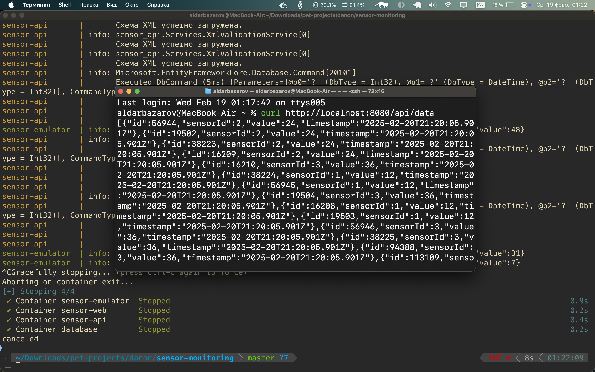

# Документация по проекту "Sensor Monitoring"

## Описание проекта

Проект "Sensor Monitoring" представляет собой систему мониторинга данных с датчиков, которая включает в себя API для обработки данных, эмулятор датчиков и веб-интерфейс для визуализации данных.

## Архитектура

Проект состоит из трех основных компонентов:

1. **Sensor API** - серверная часть, реализованная на C# с использованием ASP.NET Core, предоставляет API для взаимодействия с бизнес-логикой приложения и БД.
2. **Sensor Emulator** - эмулятор, написанный на TypeScript с использованием Node.js, который генерирует случайные данные и отправляет их на API.
3. **Sensor Web** - веб-приложение на React, которое отображает данные с датчиков и предоставляет интерфейс для взаимодействия с пользователем.

## Установка и запуск

1. **Клонирование репозитория**

   ```bash
   git clone <URL_репозитория>
   cd <папка_проекта>
   ```

2. **Доступ к приложению**
   1. Docker
      - Убедитесь, что у вас установлены все необходимые зависимости (Docker 24.x.x, Docker Compose 2.x.x).
      - API доступен по адресу: `http://localhost:8080/api`
      - Веб-приложение доступно по адресу: `http://localhost`
      - Выполните команду:
        ```bash
        docker-compose up --build
        ```
   2. No Docker
      - Убедитесь, что у вас установлены все необходимые зависимости (SDK .NET 8, Node.js 22.x.x, PostgreSQL 15.x, npm 11.x.x, yarn 1.22.x).
      - Создайте БД (sensor-monitoring) в PostgreSQL
      - Поменяйте строку подключения к БД в ./service-api/appsettings.json
      - Для запуска серверной части (Sensor API) выполните команды:
        ```bash
        cd sensor-api
        dotnet restore
        dotnet run
        ```
      - Для запуска эмулятора датчиков (Sensor Emulator) выполните команду:
        ```bash
        cd sensor-emulator
        npm i
        npm start
        ```
      - Для запуска веб-приложения (Sensor Web) выполните команду:
        ```bash
        cd sensor-web
        yarn
        yarn run dev
        ```
      - После этого вы сможете получить доступ к API по адресу: `http://localhost:8080/api` и к веб-приложению по адресу: `http://localhost:5173`.

## Структура проекта

- **sensor-api/** - серверная часть

  - `Startup.cs` - конфигурация сервисов и middleware.
  - `Controllers/` - контроллеры для обработки запросов.
  - `Models/` - модели данных.
  - `Services/` - сервисы для бизнес-логики.
  - `Migrations/` - миграции базы данных.

- **sensor-emulator/** - эмулятор датчиков

  - `src/` - исходный код эмулятора.

- **sensor-web/** - веб-приложение
  - `src/` - исходный код веб-приложения.

## Используемые технологии

- **Sensor API**: C#, ASP.NET Core, Entity Framework Core, PostgreSQL.
- **Sensor Emulator**: TypeScript, Node.js.
- **Sensor Web**: React, TypeScript, Vite, Tanstack, Radix, Tailwind.

## Логирование

Проект использует NLog и Winston для логирования событий и ошибок.
Логи сохраняются в файлы и выводятся в консоль.

## Примечания

- TODO: Забыл добавить Healthchecks
- Если есть вопросы или пожелания - пишите мне на почту или в телеграм
- Почта: a.bazarov.sas@gmail.com
- Telegram: http://t.me/aldarbazarov

## Пример ответа от сервера



